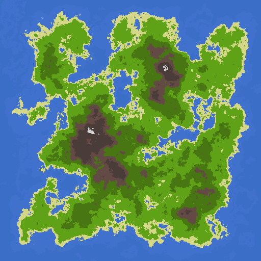
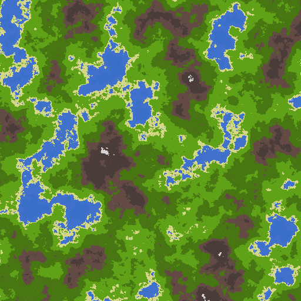

# Procedural Terrain Generation in Odin

A simple world/terrain generator written in the Odin (`stb/image` dependency).

## Features

*   Generates 2D height maps using noise (`core:math/noise`).
*   Configurable (seed, octaves, frequency, amplitude, lacunarity, persistence).
*   Optional "island" algorithm to shape the landmass into an island.
*   Customizable terrain elevation thresholds and colours.

## Example Output

Running the code will produce a `terrain.png` file in the same directory.

### Terrain Version

### Island Version

## License

MIT
