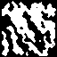

# Procedural Terrain Generation in Odin

A some simple terrain generators written in the Odin (`stb/image` dependency).

## Map/Island Features

*   Generates 2D height maps using noise (`core:math/noise`).
*   Configurable (seed, octaves, frequency, amplitude, lacunarity, persistence).
*   Optional "island" algorithm to shape the landmass into an island.
*   Customizable terrain elevation thresholds and colours.

## Cave Features

*   Generates 2D cave structures using simple cellular automata.
*   Configurable (seed, "wall" density and smoothing).

## Example Output

Running the example code will produce a `terrain.png` and `cave.png` in the same directory.

### Terrain Version

### Island Version

### Cave Example 

## License

MIT
